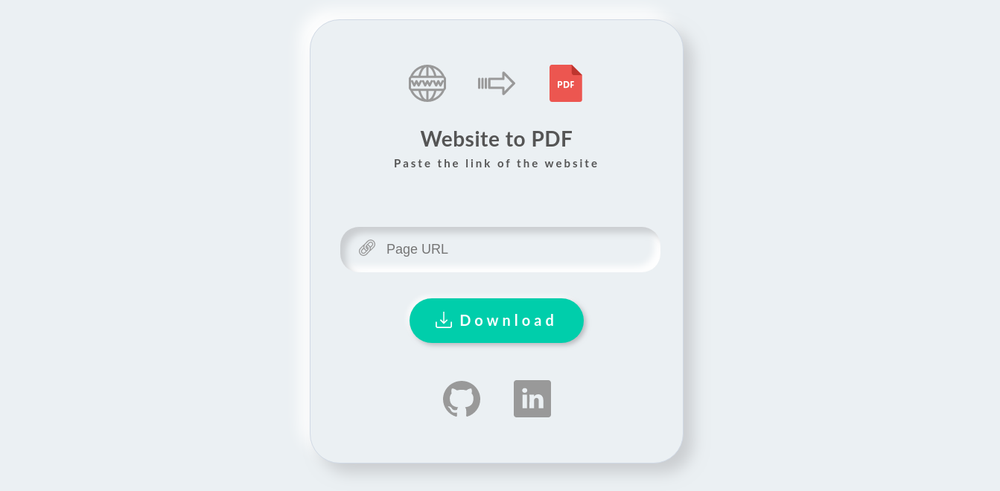
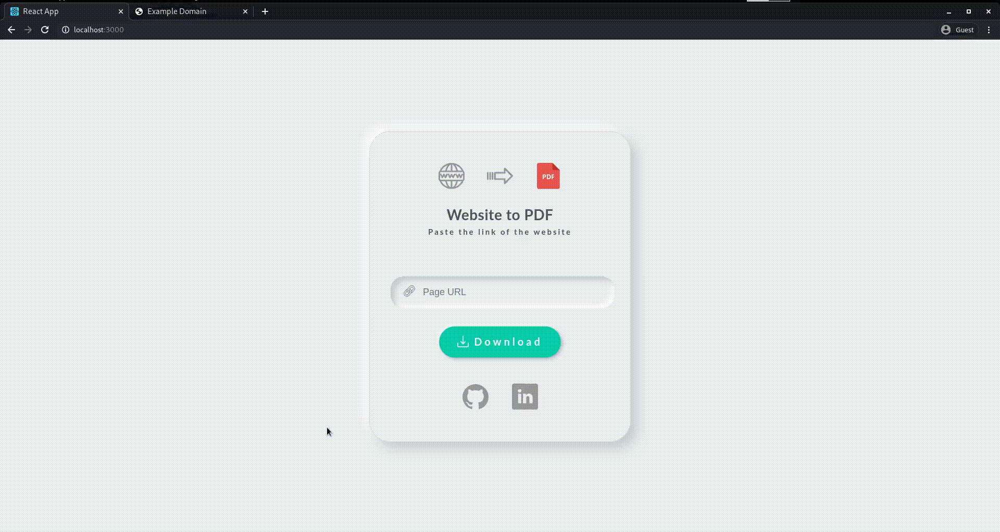

  <h1 ><a href="https://w2pdf.netlify.app/">🔥 Website to PDF 🔥</a></h1>
  <strong>
    Convert any website to a PDF fast 
  </strong>
  

## URL: https://w2pdf.netlify.app/

## Features
- **Fast** ✔️
- **No Watermarks** ✔️
- **No Ads** ✔️
- **Minimalistic UI** ✔️

And the best part is that is the PDF generated is not made up of images or snaps taken from the website, therefore one can
- **Copy Text**
- **Open links embedded in PDF** 
- **Can edit the PDF**

## Usage

